# CareFlow — System Architecture

This document describes the architecture of the **Agentic Medical Appointment Workflow** prototype. Diagrams use [Mermaid](https://mermaid.js.org/); they render on GitHub and in many IDEs.

---

## 1. High-level system context

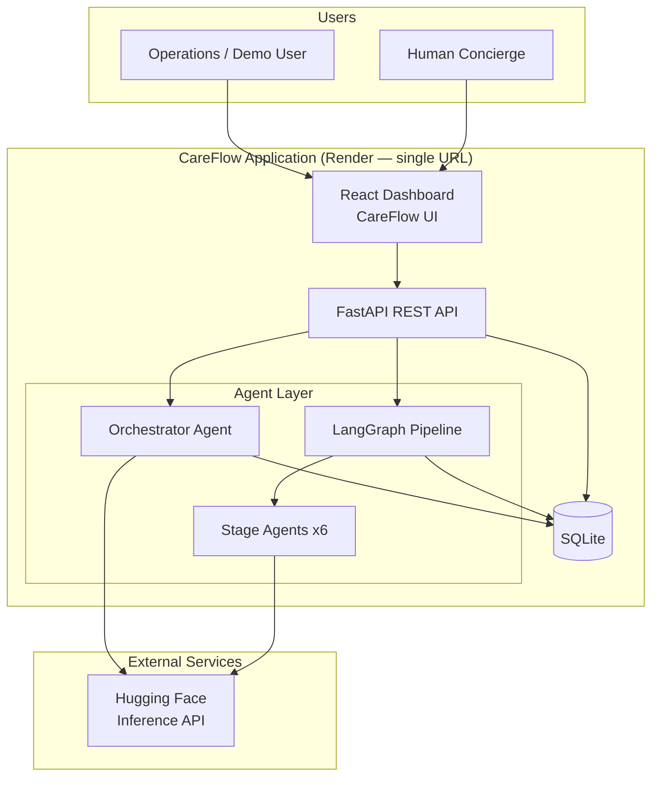

---

## 2. Layered architecture

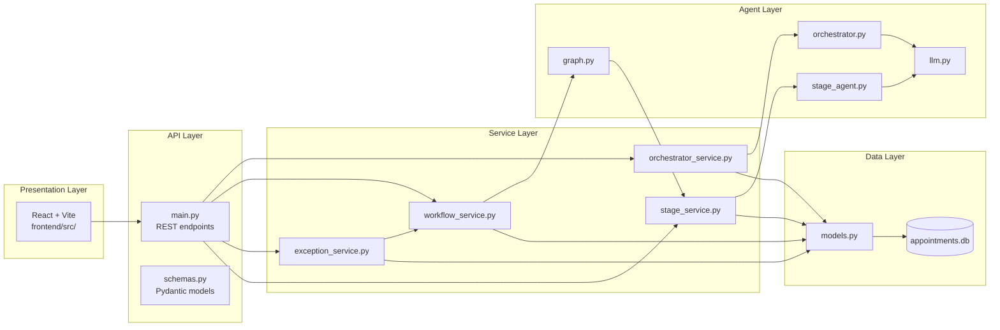

---

## 3. Deployment architecture (single URL)

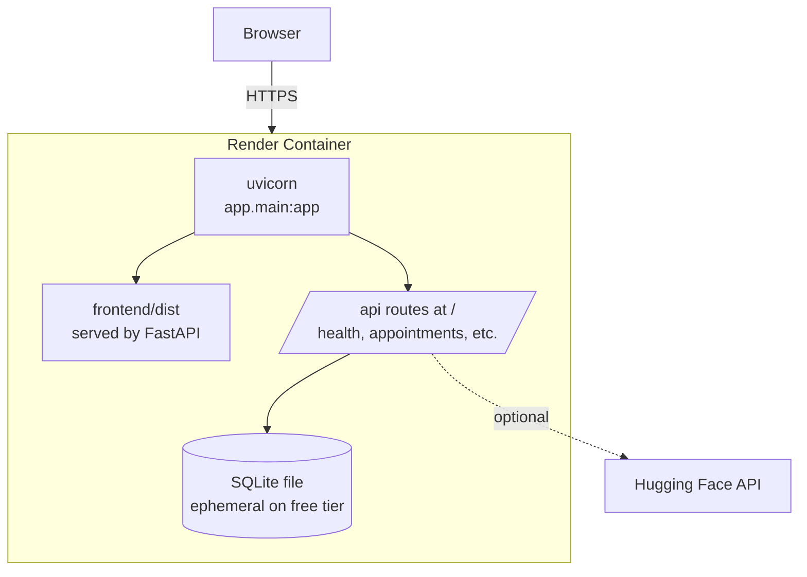

**Build pipeline:** `scripts/build.sh` → `npm run build` (frontend) + `pip install` (backend) → start `uvicorn`.

---

## 4. Frontend component architecture

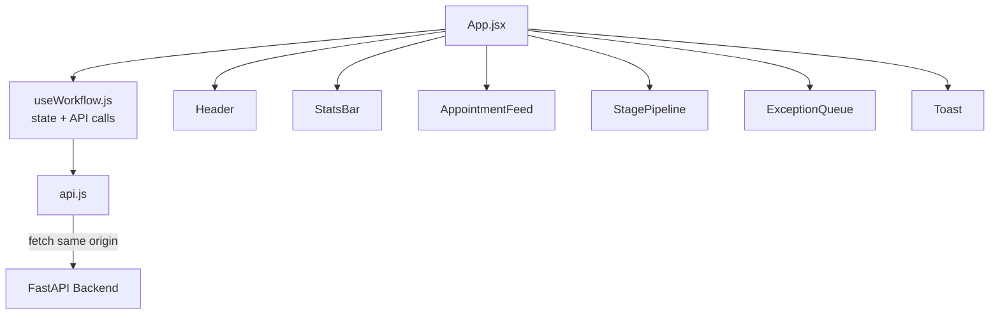

| Panel | Component | Backend endpoints used |
|-------|-----------|-------------------------|
| Feed | `AppointmentFeed` | `GET /appointments` |
| Pipeline | `StagePipeline` | `GET /appointments/{id}`, `POST .../process` |
| Exceptions | `ExceptionQueue` | `GET /exceptions`, `POST .../resolve` |
| Header | `Header` | `POST /orchestrator/run`, `POST /seed` |

---

## 5. Backend API map

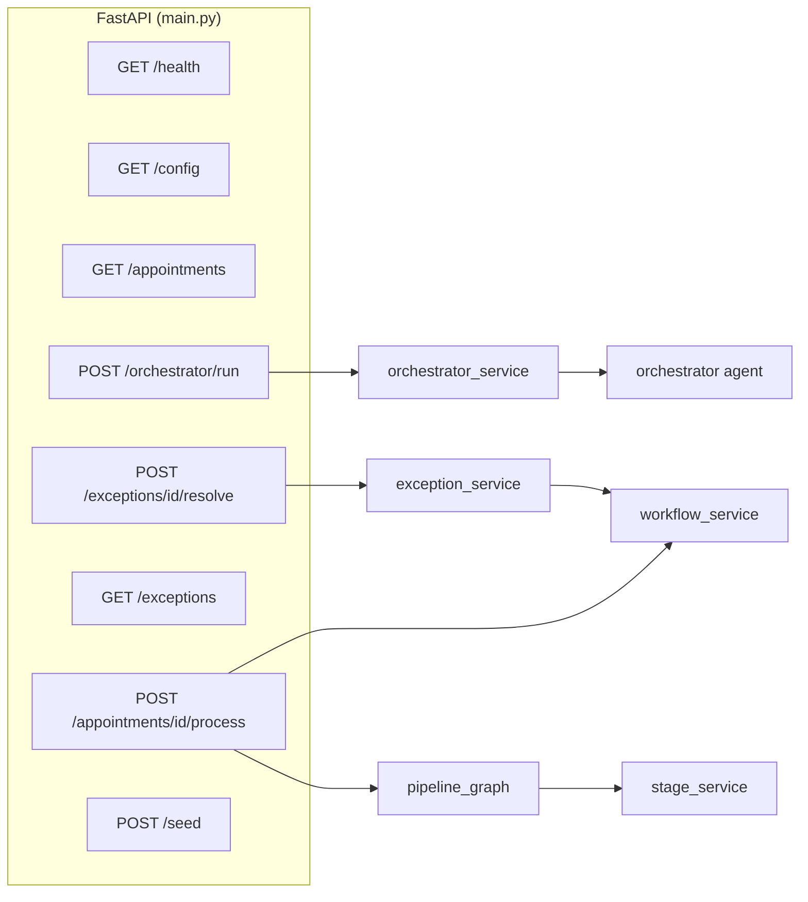

---

## 6. Intelligent orchestrator flow

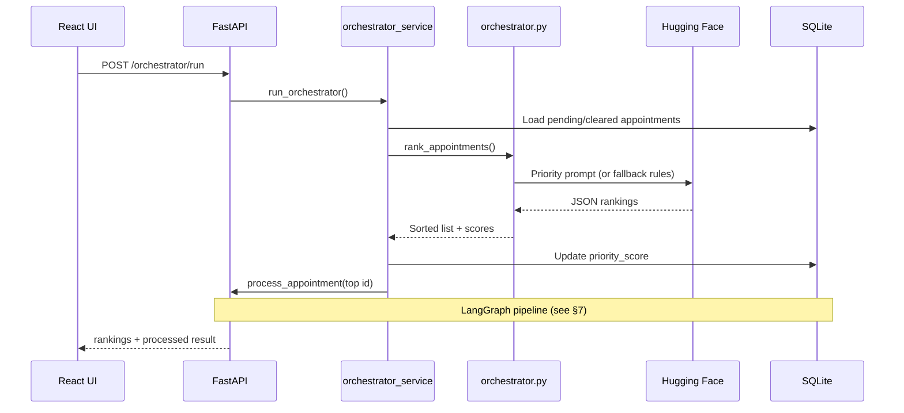

---

## 7. LangGraph processing pipeline

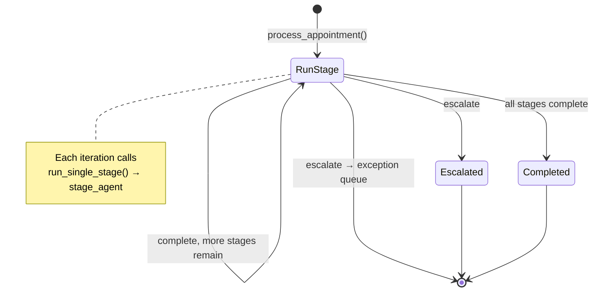

```mermaid
flowchart TB
    subgraph Node["LangGraph node: run_stage"]
        A[Set stage = processing] --> B[stage_agent LLM]
        B --> C{state?}
        C -->|complete| D{more stages?}
        C -->|escalate| E[handle_escalation]
        D -->|yes| F[current_stage++]
        D -->|no| G[status = completed]
        E --> H[status = escalated<br/>insert exception]
        F --> Node
    end
```

**Stage names (configurable via `STAGE_COUNT`):**

1. Intake Validation  
2. Insurance Check  
3. Clinical Review  
4. Scheduling  
5. Provider Assignment  
6. Final Confirmation  

---

## 8. Stage agent decision flow

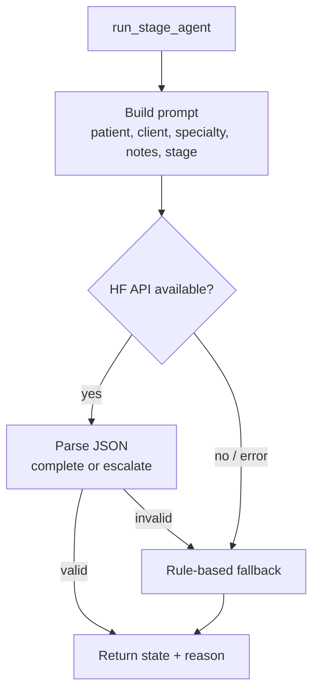

---

## 9. Human-in-the-loop (escalation & resume)

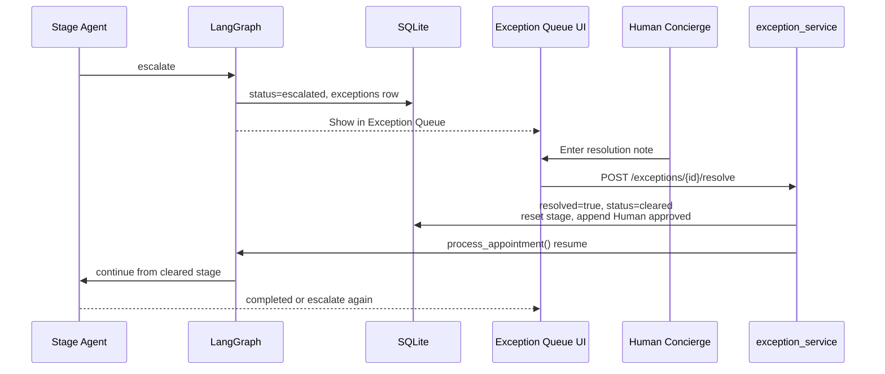

---

## 10. Data model

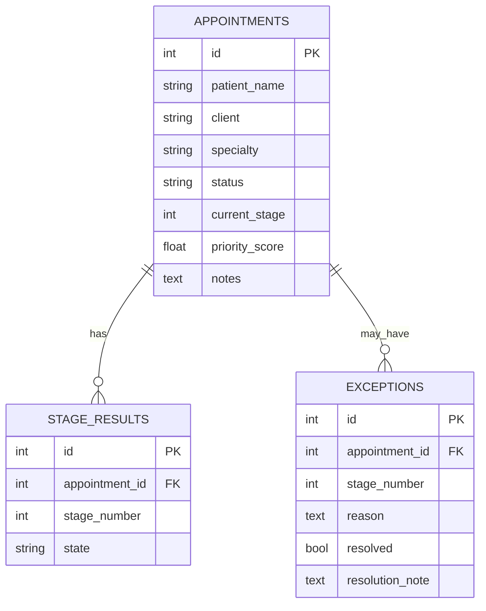

**Appointment statuses:** `pending` → `in_progress` → `completed` | `escalated` → `cleared` → `in_progress` → …

**Stage states:** `not_started` | `processing` | `complete` | `escalate`

---

## 11. End-to-end request flows

### A. Run orchestrator (happy path)

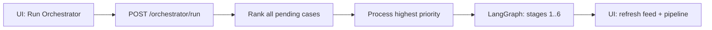

### B. Escalate → resolve → resume

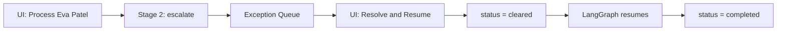

---

## 12. Repository structure (module map)

```
Appoinment-Management/
│
├── frontend/                    # Presentation
│   └── src/
│       ├── App.jsx
│       ├── api.js
│       ├── hooks/useWorkflow.js
│       └── components/          # Feed, Pipeline, ExceptionQueue, UI
│
├── backend/
│   └── app/
│       ├── main.py                # HTTP entry, mounts React dist
│       ├── static_files.py        # Single-URL static serving
│       ├── config.py              # STAGE_COUNT, env settings
│       ├── models.py              # SQLAlchemy entities
│       ├── database.py
│       ├── seed.py
│       ├── agents/
│       │   ├── llm.py             # HuggingFaceEndpoint wrapper
│       │   ├── orchestrator.py    # Master priority agent
│       │   ├── stage_agent.py     # Per-stage complete/escalate
│       │   └── graph.py           # LangGraph pipeline
│       └── services/
│           ├── orchestrator_service.py
│           ├── workflow_service.py
│           ├── stage_service.py
│           └── exception_service.py
│
├── scripts/build.sh             # Production build (Render)
└── render.yaml                  # Render Blueprint
```

---

## 13. Technology matrix

| Concern | Technology | Role |
|---------|------------|------|
| UI | React 18, Vite | Dashboard facade |
| API | FastAPI | REST + serve SPA |
| Persistence | SQLite, SQLAlchemy | Appointments, stages, exceptions |
| Orchestration | LangGraph | Sequential stage loop with branch on escalate |
| LLM integration | LangChain, langchain-huggingface | Prompt → JSON decisions |
| Inference | Hugging Face API | Optional; fallback rules if unavailable |
| Hosting | Render (free) | Single web service, one public URL |

---

## 14. Design principles (prototype)

| Principle | How it shows up |
|-----------|------------------|
| Facade over production | No auth, HIPAA, or real EHR integrations |
| Separation of concerns | Agents decide; services enforce DB/state |
| Human-in-the-loop as first-class | Exception queue + Cleared + auto-resume |
| Demo reliability | Rule-based fallbacks when LLM fails |
| Single deployable unit | FastAPI serves UI + API for interviews |

---

## Related docs

- [README.md](./README.md) — setup, demo script, deployment steps
